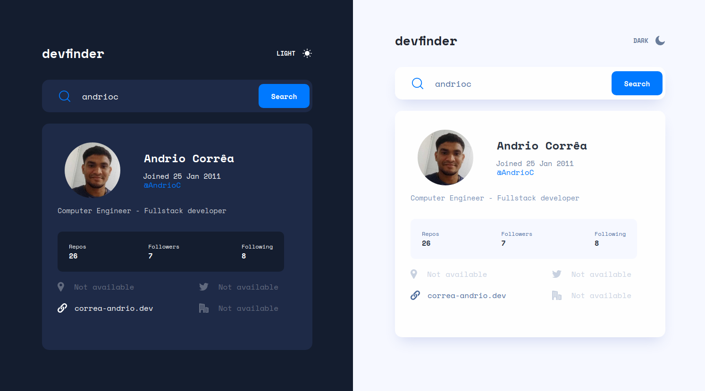

# Github User Search App - Challenge

Hello, this project was created to complete the frontendmentor challenge. Feel free to use it as your guide. Below I'll show you how you can use it on your PC. But first, take a look at the images from the project.

<h1>
    
Desktop - dark and light version

    
</h1>

<h1>
    
Table - dark and light version

    
</h1>

<h1>
    
Mobile - dark and light version

    
</h1>

<h1>
    
Demo

    
</h1>

## :desktop_computer: Available Scripts

In the project directory, you can run:

### `yarn`

This way you can install all the dependencies that are required to run this project.

### `yarn start`
Runs the app in the development mode.\
Open [http://localhost:3000](http://localhost:3000) to view it in the browser.

The page will reload if you make edits.\
You will also see any lint errors in the console.

## :fire: Technologies

This project was built using the following techs:

- ReactJS.
- TypeScript.
- Styled Components.
- Axios.
- Github API.